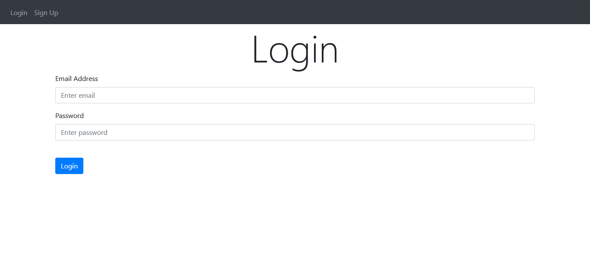

# Flask Note Taking Website Example

[](https://www.python.org/)

______________________________________________________________________

## Requirements

- Latest version of [Python](https://www.python.org/)
- flask library
- Flask-SQLAlchemy library
- flask-login library

To install the requirements, open the repo in a terminal and type

```shell
pip3 install -r requirements.txt
```

## Running the App

```shell
python3 main.py
```

## Viewing the App

Go to `127.0.0.1:5000`
